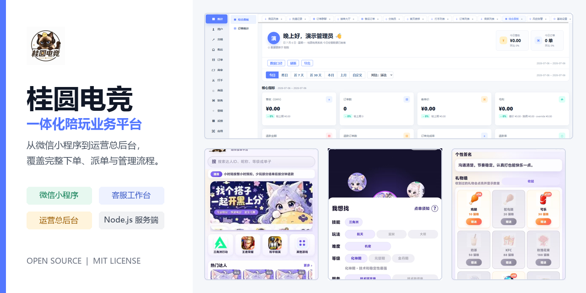
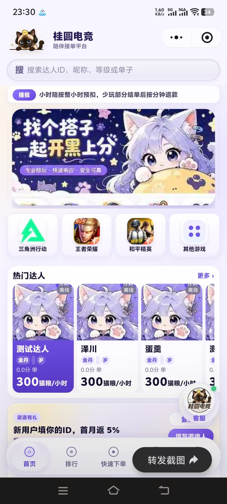
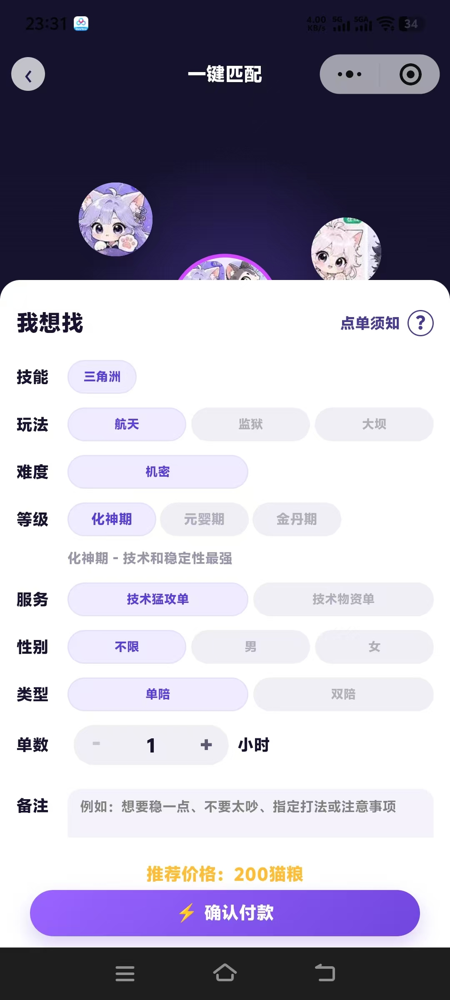
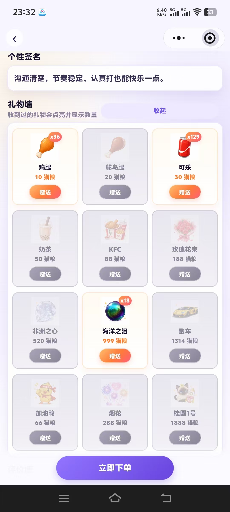
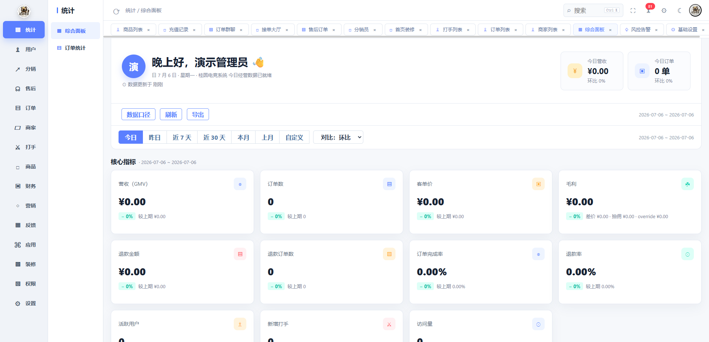

<div align="center">
  
  <h1>桂圆电竞陪玩平台</h1>
  <p><strong>微信小程序 + 客服工作台 + 运营总后台 + Node.js 服务端</strong></p>
  <p>覆盖下单、派单、群聊、评价、余额、会员、礼物、结算与运营配置的完整业务项目</p>

  <p>
    
    
    
    
  </p>
</div>



## 项目组成

| 模块 | 技术 | 主要能力 |
|---|---|---|
| 微信小程序 | JavaScript / WXML / WXSS | 用户下单、充值、群聊、评价、订单与打手工作台 |
| 客服后台 | HTML / CSS / JavaScript | 客服接待、订单处理、代下单、快捷回复与工单 |
| 运营总后台 | HTML / CSS / JavaScript | 商品、人员、订单、财务、会员、礼物和系统配置 |
| 服务端 | Node.js 原生 HTTP | API、权限隔离、数据持久化、消息与支付回调 |

## 核心功能

- 用户、客服、管理员与服务人员多角色业务流程
- 自动派单和客服会话隔离
- 订单群聊及三端消息同步
- 商品、游戏、玩法、等级和人员目录管理
- 订单取消退款、完成结算和评价联动
- 余额流水、会员等级、虚拟礼物与邀请奖励
- 微信登录、服务号支付和虚拟支付接口预留
- 客服工作台和运营总后台完整页面

## 界面预览

### 微信小程序

<p align="center">
  
  
  
</p>

### 运营总后台



## 隐私安全

此仓库是经过脱敏的公开版本，不包含：

- 生产域名、服务器 IP 或部署路径
- 真实小程序 AppID、商户号、支付密钥或证书
- 后台账号密码、微信密钥或回调令牌
- 订单、客户、聊天、财务等生产数据
- 用户上传文件和微信开发者私有配置

所有部署参数通过 `server/.env` 提供，该文件已被 Git 忽略。完整配置说明见 [docs/CONFIGURATION.md](docs/CONFIGURATION.md)。

## 快速开始

```powershell
cd server
Copy-Item .env.example .env
```

编辑 `.env`，至少设置强密码的初始化管理员账号，然后启动：

```powershell
npm start
```

本地访问：

- 客服后台：`http://127.0.0.1:8787/`
- 运营总后台：`http://127.0.0.1:8787/admin`

微信小程序使用微信开发者工具导入 `miniprogram` 目录。公开版本的 AppID 为 `touristappid`，正式部署时在本地私有配置中填写自己的 AppID，并把示例 API 地址替换为自己的服务地址。

## 项目结构

```text
guiyuan-esports-platform/
├── miniprogram/          # 微信原生小程序
├── server/
│   ├── public/           # 客服后台和运营总后台
│   ├── data/             # 演示目录与本地运行数据
│   ├── .env.example      # 环境变量模板
│   └── server.js         # Node.js 服务端
├── docs/                 # 架构、配置和安全说明
└── LICENSE
```

## 权限模型

- 客服只能读取和修改分配给自己的会话及订单。
- 运营管理员可查看全局数据并管理商品、人员和财务配置。
- 小程序公开接口与后台接口分开，后台接口使用 Bearer Token。
- 官方 `main` 分支受保护，外部贡献通过 Fork 和 Pull Request 提交。

## 文档

- [系统架构](docs/ARCHITECTURE.md)
- [配置与部署](docs/CONFIGURATION.md)
- [安全说明](docs/SECURITY.md)

## 开源协议

项目采用 [MIT License](LICENSE)。任何人都可以克隆、Fork 和在本地修改；对官方仓库的改动需要经过维护者审核与合并。
