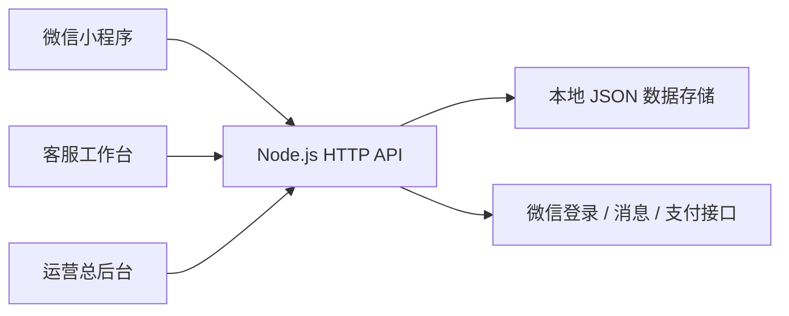

# 系统架构

## 业务边界

- `miniprogram/`：用户端、服务人员工作台和小程序内群聊。
- `server/public/index.html`：客服工作台入口。
- `server/public/admin.html`：运营总后台入口。
- `server/server.js`：静态资源、API、鉴权、派单、订单状态和支付回调。
- `server/data/store.json`：本地运行数据，首次启动自动创建且不会提交到 Git。

## 权限流程

客服登录后获得服务端会话令牌。服务端按当前客服身份过滤会话和订单，并在修改、邀请服务人员、发送消息等操作前再次校验归属。管理员使用独立登录入口和令牌访问全局接口。

订单状态以服务端数据为准。订单取消、完成、评价、余额退款和服务人员结算都由服务端统一处理，小程序本地缓存仅用于界面展示和离线辅助。
